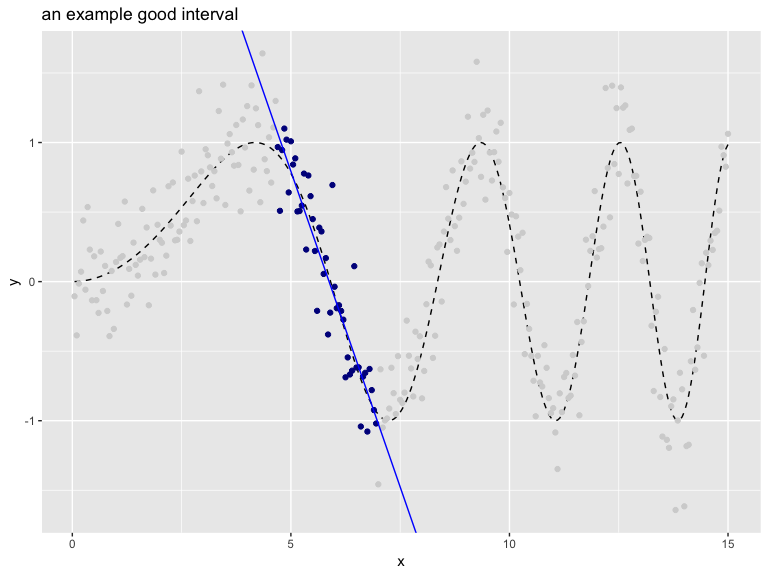
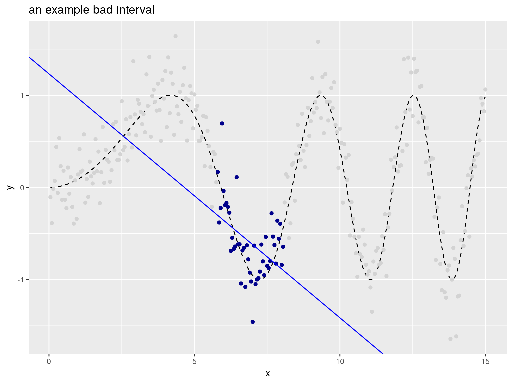
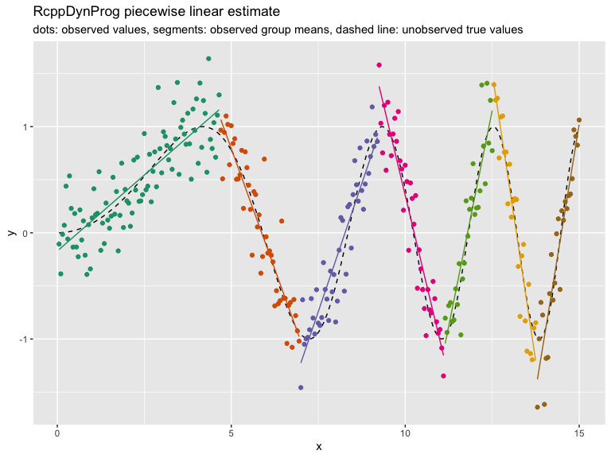

<!-- README.md is generated from README.Rmd. Please edit that file -->

## The package

[`RcppDynProg`](https://github.com/WinVector/RcppDynProg) is an
[`Rcpp`](https://CRAN.R-project.org/package=Rcpp) based
[`R`](https://www.r-project.org) package that implements simple, but
powerful, table-based [dynamic
programming](https://en.wikipedia.org/wiki/Dynamic_programming). This
package can be used to optimally solve the minimum cost partition into
intervals problem (described below) and is useful in building piecewise
estimates of functions (shown in this note).

## The abstract problem

The primary problem
[`RcppDynProg::solve_interval_partition()`](https://winvector.github.io/RcppDynProg/reference/solve_interval_partition.html)
is designed to solve is formally given as follows.

> Minimum cost partition into intervals.
> 
> Given: a positive integer `n` and an a \(n\) by `n` matrix called
> `costs`.
> 
> Find: an increasing sequence of integers `soln` with `length(soln)==k
> (>=2)`, `soln[1] == 1`, and `soln[k] == n+1` such that
> `sum[i=1,...,k-1] costs[soln[i], soln[i+1]-1]` is minimized.

To rephrase: `costs[i,j]` is specifying the cost of taking the interval
of integers `{i,...,j}` (inclusive) as a single element of our solution.
The problem is to find the minimum cost
[partition](https://en.wikipedia.org/wiki/Partition_of_a_set) of the set
of integers `{1,...,n}` as a sequence of intervals. A user supplies a
matrix of costs of *every* possible interval of integers, and the solver
then finds what disjoint *set* of intervals that cover `{1,...,n}` have
the lowest sum of costs. The user encodes their optimization problem a
family of interval costs (`n(n-1)/2` of them, which is a lot- but is
tractable) and the algorithm quickly finds the best simultaneous set of
intervals (there are `2^(n-1)` partitions into intervals, so exhaustive
search would not be practical).

We can illustrate this abstract problem as follows (if this is too
abstract, please skip forward to the concrete application).

Suppose we have the following cost matrix.

``` r
costs <- matrix(c(1.5, NA ,NA ,1 ,0 , NA, 5, -1, 1), 
                nrow = 3)
print(costs)
 #       [,1] [,2] [,3]
 #  [1,]  1.5    1    5
 #  [2,]   NA    0   -1
 #  [3,]   NA   NA    1
```

Then the optimal partition is found as follows.

``` r
library("RcppDynProg")
soln <- solve_interval_partition(costs, nrow(costs))
print(soln)
 #  [1] 1 2 4
```

The sequence `[1, 2, 4]` is a just compact representation for the
following sequence of intervals.

``` r
lapply(
  seq_len(length(soln)-1),
  function(i) {
    soln[i]:(soln[i+1]-1)
  })
 #  [[1]]
 #  [1] 1
 #  
 #  [[2]]
 #  [1] 2 3
```

Which is saying the optimal partition into intervals is to the sequence
of sets `[{1}, {2, 3}]` which has total cost `costs[1,1] + costs[2,3]`.
The dynamic programming solver knew to take the expensive set `{1}` to
allow the cheap set `{2, 3}` to be in its chosen partition. This is the
essence of dynamic programming: finding an optimal *global* solution,
even if it requires odd-looking local choices.

## An application

The intended application of `RcppDynProg` is to find optimal piecewise
solutions to single-variable modeling problems. For example consider the
following
data.


In the above we have an input (or independent variable) `x` and an
observed outcome (or dependent variable) `y_observed` (portrayed as
points). `y_observed` is the unobserved idea value `y_ideal` (portrayed
by the dashed curve) plus independent noise. The modeling goal is to get
close the `y_ideal` curve using the `y_observed` observations. Obviously
this [can be done with a smoothing
spline](https://github.com/WinVector/RcppDynProg/blob/master/extras/SegmentationL.md),
but let’s use `RcppDynProg` to find a piecewise linear fit.

To encode this as a dynamic programming problem we need to build a cost
matrix that for every consecutive interval of `x`-values we have
estimated the out-of sample quality of fit. This is supplied by the
function `RcppDynProg::lin_costs()` (using the [PRESS
statistic](http://www.win-vector.com/blog/2014/09/estimating-generalization-error-with-the-press-statistic/)),
but lets take a quick look at the idea.

The following interval is a good interval, as all the chosen points
(shown in dark blue) are in a nearly linear arrangement. The in-sample
price of the interval would be the total sum of residuals of a linear
model fit on the selected region (and the out of sample price would be
given by the PRESS
statistic).



The “cost” (or loss) of this interval can be estimated as shown.

``` r
print(good_interval_indexes) # interval 
 #  [1]  94 139
print(1 + good_interval_indexes[2] - good_interval_indexes[1]) # width
 #  [1] 46
fit <- lm(y_observed ~ x, 
          data = d[good_interval_indexes[1]:good_interval_indexes[2], ])
sum(fit$residuals^2) # cost for interval
 #  [1] 2.807998
```

The following interval is a bad interval, as all the chosen points
(shown in dark blue) are not in a nearly linear
arrangement.



``` r
print(bad_interval_indexes) # interval
 #  [1] 116 161
print(1 + bad_interval_indexes[2] - bad_interval_indexes[1]) # width
 #  [1] 46
fit <- lm(y_observed ~ x, 
          data = d[bad_interval_indexes[1]:bad_interval_indexes[2], ])
sum(fit$residuals^2) # cost for interval
 #  [1] 5.242647
```

The user would price all of the intervals individually, and then ask the
solver to find the best simultaneous set of intervals.

The complete solution is worked as follows (using the
[`RcppDynProg::solve_for_partition()`](https://winvector.github.io/RcppDynProg/reference/solve_for_partition.html)
function which wraps all the steps together, converting from indices to
`x`-coordinates).

``` r
x_cuts <- solve_for_partition(d$x, d$y_observed, penalty = 1)
print(x_cuts)
 #         x       pred group  what
 #  1   0.05 -0.1570880     1  left
 #  2   4.65  1.1593754     1 right
 #  3   4.70  1.0653666     2  left
 #  4   6.95 -0.9770792     2 right
 #  5   7.00 -1.2254925     3  left
 #  6   9.20  0.8971391     3 right
 #  7   9.25  1.3792437     4  left
 #  8  11.10 -1.1542021     4 right
 #  9  11.15 -1.0418353     5  left
 #  10 12.50  1.1519490     5 right
 #  11 12.55  1.3964906     6  left
 #  12 13.75 -1.2045219     6 right
 #  13 13.80 -1.3791405     7  left
 #  14 15.00  1.0195679     7 right

d$estimate <- approx(x_cuts$x, x_cuts$pred, 
                     xout = d$x, 
                     method = "linear", rule = 2)$y
d$group <- as.character(
  findInterval(d$x, x_cuts[x_cuts$what=="left", "x"]))

plt2 <- ggplot(data= d, aes(x = x)) + 
  geom_line(aes(y = y_ideal), linetype=2) +
  geom_point(aes(y = y_observed, color = group)) +
  geom_line(aes(y = estimate, color = group)) +
  ylab("y") +
  ggtitle("RcppDynProg piecewise linear estimate",
          subtitle = "dots: observed values, segments: observed group means, dashed line: unobserved true values") + 
  theme(legend.position = "none") +
  scale_color_brewer(palette = "Dark2")
print(plt2)
```



[`RcppDynProg::solve_for_partition()`](https://winvector.github.io/RcppDynProg/reference/solve_for_partition.html)
finds a partition of a relation into a number of linear estimates. Each
interval is priced using out-of sample cost via the [PRESS
statistic](http://www.win-vector.com/blog/2014/09/estimating-generalization-error-with-the-press-statistic/)
plus the specified penalty (to discourage small intervals). Notice,
however, the user did not have to specify a *k* (or number of intervals)
to a get good result.

The entire modeling procedure is wrapped as a
[`vtreat`](https://github.com/WinVector/vtreat)
[custom-coder](http://www.win-vector.com/blog/2017/09/custom-level-coding-in-vtreat/)
in the function
[`RcppDynProg::piecewise_linear()`](https://winvector.github.io/RcppDynProg/reference/piecewise_linear.html).
This allows such variable treatments to be easily incorporated into
modeling pipelines (example
[here](https://github.com/WinVector/zmPDSwR/blob/master/KDD2009/KDD2009vtreat.md)).

In addition to a piecewise linear solver we include a piecewise constant
solver, which is demonstrated
[here](https://winvector.github.io/RcppDynProg/articles/Segmentation.html).
Other applications can include peak detection, or any other application
where the per-segment metrics are independent.

## The methodology

The solver is fast through to the use of 3 techniques:

1.  `RcppDynProg::solve_for_partition()` includes a problem reduction
    heuristic in the spirit of the [parameterized
    complexity](https://www.springer.com/us/book/9780387948836)
    methodology.
2.  Ordered (or interval) partition problems are amenable to dynamic
    programming because initial segments of an interval partition have
    succinct summaries (just the right-most index and how many segments
    were used to get to this point).
3.  `RcppDynProg` is a fast `C++` implementation using `Rcpp`.

Some [basic
timings](https://github.com/WinVector/RcppDynProg/blob/master/extras/Timings.md)
show [the `C++`
implementation](https://github.com/WinVector/RcppDynProg/blob/master/src/solve_interval_partition.cpp)
can be over 200 times faster than [a direct transliteration
`R`](https://github.com/WinVector/RcppDynProg/blob/master/R/solve_dyn_R.R)
of the same code (so not vectorized, not fully R idiomatic, some time
lost to
[`seqi()`](https://winvector.github.io/wrapr/reference/seqi.html)
abstraction), and [over 400 times
faster](https://github.com/WinVector/RcppDynProg/blob/master/extras/time_python.ipynb)
than a [`Python` direct
transliteration](https://github.com/WinVector/RcppDynProg/blob/master/extras/DynProg.py)
of the same code (so not optimized, and not “Pythonic”). The
non-optimized and non-adapted nature of the code translations
unfortunately exaggerates the speedup, however the `Rcpp` is likely
buying as a solid factor of over 100- as `C++` is going to be much more
efficient at all of the index-chasing this dynamic programming solution
is based on.

A note on problem complexity: general partition problems (where we do
not restrict the subsets to be intervals) are NP-hard, so not thought to
be amenable to efficient general solutions at scale (subset sum problems
being good examples).

-----

`RcppDynProg` can be installed from `CRAN` with:

``` r
install.packages("RcppDynProg")
```

-----

Some other relevant segmentation and dynamic programming methods
include:

  - Piecewise or [segmented
    regression](https://en.wikipedia.org/wiki/Segmented_regression) in
    general.
  - [`GAM`](https://CRAN.R-project.org/package=gam),
    [`mgcv`](https://CRAN.R-project.org/package=mgcv), [quantile
    segmentation](https://github.com/WinVector/vtreat/blob/master/R/segmented_variable.R),
    [`spline`](https://github.com/WinVector/vtreat/blob/master/R/spline_variable.R)
    methods.
  - The [`segmented`
    package](https://CRAN.R-project.org/package=segmented)
    break-point/change-point regression package (worked example
    [here](https://github.com/WinVector/RcppDynProg/blob/master/extras/sp500/segmented_Example.md)).
  - \(l_1\) Trend Filtering, which we discuss
    [here](https://github.com/WinVector/RcppDynProg/blob/master/extras/sp500/sp500_example.pdf).
  - The [`dynprog` package](https://CRAN.R-project.org/package=dynprog),
    which is a general DSL based memoizer.
