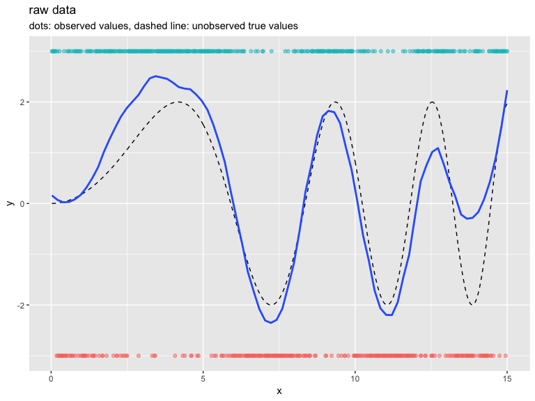

Logistic Link Segmentation
================
John Mount
2019-02-01

In this example we fit a piecewise logistic-linear (linear in link-space) function to example data.
Please see [here](https://github.com/WinVector/RcppDynProg) for a discussion of the methodology.

Logistic link segmentation does not seem to be a good idea. The small segments just don't look like the (hidden) idea distrubitions at small scale.

``` r
library("RcppDynProg")
library("wrapr")

plot <- requireNamespace("ggplot2", quietly = TRUE)
if(plot) {
  library("ggplot2")
}

sigmoid <- function(z) {
  1/(1+exp(-z))
}

mult <- 2
set.seed(2018)
g <- 200
d <- data.frame(
  x = 0.025*(1:(3*g))) # ordered in x
d$y_ideal <- mult*sin((0.3*d$x)^2)
d$y_observed <- ifelse(runif(length(d$y_ideal)) <= sigmoid(d$y_ideal), 1, 0)
d$y_plot <- (1+mult)*(2*d$y_observed-1)
w <- rep(1.0, nrow(d))

if(plot) {
  plt1 <- ggplot(data = d, aes(x = x)) + 
    geom_line(aes(y = y_ideal), linetype=2) +
    geom_point(aes(y = y_plot, color = as.factor(d$y_observed)), alpha = 0.5) +
    geom_smooth(aes(y = y_plot), span = 0.25, se = FALSE) +
    ylab("y") +
    guides(color = FALSE) +
    ggtitle("raw data", 
            subtitle = "dots: observed values, dashed line: unobserved true values")
  print(plt1)
}
```

    ## `geom_smooth()` using method = 'loess' and formula 'y ~ x'



``` r
costs <- lin_costs_logistic(d$x, d$y_observed, w, 40, seq_len(nrow(d)))
costs <- costs + 5
soln <- solve_interval_partition(costs, 20)
print(soln)
```

    ## [1]   1  59 255 315 424 471 601

``` r
preds <- numeric(nrow(d))
for(i in seqi(1, length(soln)-1)) {
  predsi <- logistic_fits(d$x, d$y_observed, w, soln[[i]]-1, soln[[i+1]]-2)
  preds[seqi(soln[[i]], soln[[i+1]]-1)] <- predsi
}
d$link <- pmin(5, pmax(-5, preds))
d$group <- findInterval(seq_len(nrow(d)), soln)


if(plot) {
  plt2 <- ggplot(data = d, aes(x = x)) + 
    geom_line(aes(y = y_ideal), linetype=2) +
    geom_line(aes(y = link, group = group), linetype=3, color="blue") +
    geom_point(aes(y = y_plot, color = as.factor(d$y_observed)), alpha = 0.5) +
    ylab("y") +
    guides(color = FALSE) +
    ggtitle("raw data", 
            subtitle = "dots: observed values, cuts/curve: recovered model")
  for(ci in soln) {
    if((ci>1)&&(ci<nrow(d))) {
      plt2 <- plt2 + geom_vline(xintercept = d$x[[ci]], color = "blue")
    }
  }
  print(plt2)
}
```


