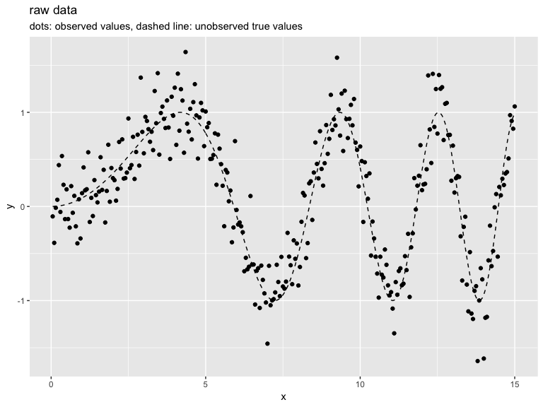
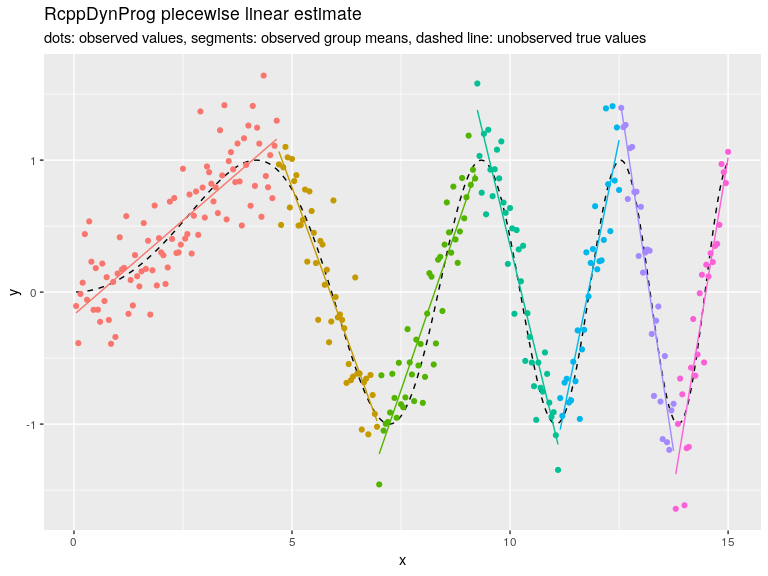
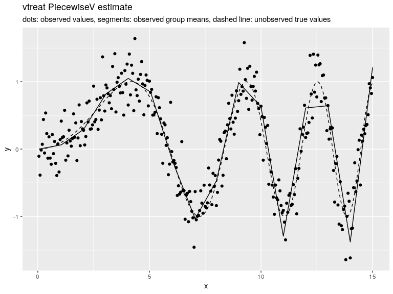
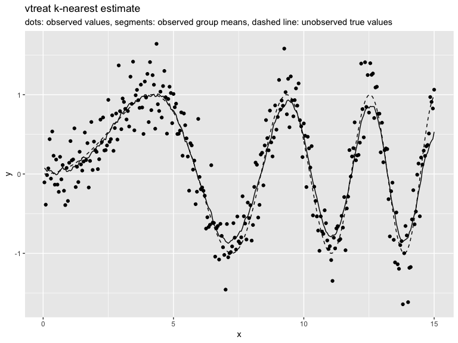
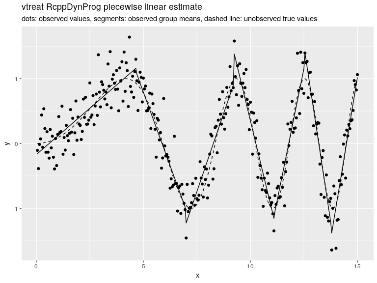
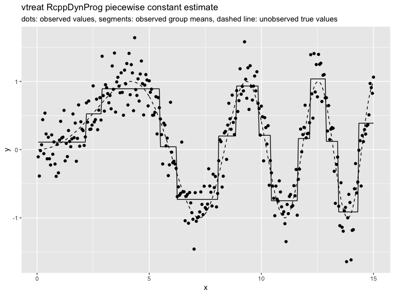
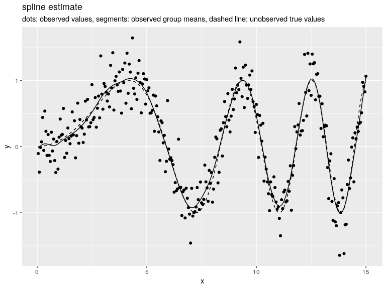

Linear Segmentation
================
John Mount
2019-01-01

In this example we fit a piecewise linear function to example data.
Please see [here](https://github.com/WinVector/RcppDynProg) for an discussion of the methodology.

``` r
library("RcppDynProg")
library("ggplot2")

set.seed(2018)
g <- 100
d <- data.frame(
  x = 0.05*(1:(3*g))) # ordered in x
d$y_ideal <- sin((0.3*d$x)^2)
d$y_observed <- d$y_ideal + 0.25*rnorm(length(d$y_ideal))


plt1 <- ggplot(data= d, aes(x = x)) + 
  geom_line(aes(y = y_ideal), linetype=2) +
  geom_point(aes(y = y_observed)) +
  ylab("y") +
  ggtitle("raw data", 
          subtitle = "dots: observed values, dashed line: unobserved true values")
print(plt1)
```



``` r
x_cuts <- solve_for_partition(d$x, d$y_observed, penalty = 1)
print(x_cuts)
```

    ##        x       pred group  what
    ## 1   0.05 -0.1570880     1  left
    ## 2   4.65  1.1593754     1 right
    ## 3   4.70  1.0653666     2  left
    ## 4   6.95 -0.9770792     2 right
    ## 5   7.00 -1.2254925     3  left
    ## 6   9.20  0.8971391     3 right
    ## 7   9.25  1.3792437     4  left
    ## 8  11.10 -1.1542021     4 right
    ## 9  11.15 -1.0418353     5  left
    ## 10 12.50  1.1519490     5 right
    ## 11 12.55  1.3964906     6  left
    ## 12 13.75 -1.2045219     6 right
    ## 13 13.80 -1.3791405     7  left
    ## 14 15.00  1.0195679     7 right

``` r
d$estimate <- approx(x_cuts$x, x_cuts$pred, xout = d$x, method = "linear", rule = 2)$y
d$group <- as.character(findInterval(d$x, x_cuts[x_cuts$what=="left", "x"]))
```

``` r
print(sum((d$y_observed - d$y_ideal)^2))
```

    ## [1] 20.42462

``` r
print(sum((d$estimate - d$y_ideal)^2))
```

    ## [1] 3.536541

``` r
print(sum((d$estimate - d$y_observed)^2))
```

    ## [1] 20.53796

``` r
plt2 <- ggplot(data= d, aes(x = x)) + 
  geom_line(aes(y = y_ideal), linetype=2) +
  geom_point(aes(y = y_observed, color = group)) +
  geom_line(aes(y = estimate, color = group)) +
  ylab("y") +
  ggtitle("RcppDynProg piecewise linear estimate",
          subtitle = "dots: observed values, segments: observed group means, dashed line: unobserved true values") + 
  theme(legend.position = "none")
print(plt2)
```



``` r
use_vtreat <- requireNamespace("vtreat", quietly = TRUE)
```

Here we show many of the [`vtreat`](https://github.com/WinVector/vtreat) [custom variable coders](http://www.win-vector.com/blog/2017/09/custom-level-coding-in-vtreat/). An application of these coders can be found [here](https://github.com/WinVector/zmPDSwR/blob/master/KDD2009/KDD2009vtreat.md).

``` r
spline_variable <- function(varName, x, y, w = NULL) {
  if(is.null(w)) {
    w <- numeric(n) + 1
  }
  nknots <- 100
  spline <- stats::smooth.spline(x, y, 
                                 w = w,
                                 nknots = nknots,
                                 keep.data = FALSE, 
                                 keep.stuff = FALSE,
                                 cv = TRUE)$fit
  estimate <- stats::predict(spline, x)$y
  return(estimate)
}

customCoders = list('c.PiecewiseV.num' = vtreat::solve_piecewise,
                    'n.PiecewiseV.num' = vtreat::solve_piecewise,
                    'c.knearest.num' = vtreat::square_window,
                    'n.knearest.num' = vtreat::square_window,
                    'c.spline.num' = spline_variable,
                    'n.spline.num' = spline_variable,
                    'c.PiecewiseLin.num' = RcppDynProg::piecewise_linear,
                    'n.PiecewiseLin.num' = RcppDynProg::piecewise_linear,
                    'c.PiecewiseC.num' = RcppDynProg::piecewise_constant,
                    'n.PiecewiseC.num' = RcppDynProg::piecewise_constant)
codeRestriction = c("PiecewiseV", 
                    "knearest",
                    "spline",
                    "PiecewiseLin",
                    "PiecewiseC")

trt <- vtreat::designTreatmentsN(
  d, 
  'x', 'y_observed',
  customCoders = customCoders,
  codeRestriction = codeRestriction,
  verbose = FALSE)
knitr::kable(trt$scoreFrame[, c("varName", "rsq", "sig")])
```

| varName         |        rsq|  sig|
|:----------------|----------:|----:|
| x\_PiecewiseV   |  0.8064672|    0|
| x\_knearest     |  0.7415207|    0|
| x\_spline       |  0.8486192|    0|
| x\_PiecewiseLin |  0.8380624|    0|
| x\_PiecewiseC   |  0.6975840|    0|

``` r
dt <- vtreat::prepare(trt, d)
dt$y_observed <- NULL
d <- cbind(d, dt)
```

``` r
print(sum((d$x_PiecewiseV - d$y_ideal)^2))
```

    ## [1] 5.336369

``` r
print(sum((d$x_PiecewiseV - d$y_observed)^2))
```

    ## [1] 25.18626

``` r
print(sum((d$x_knearest - d$y_ideal)^2))
```

    ## [1] 3.825642

``` r
print(sum((d$x_knearest - d$y_observed)^2))
```

    ## [1] 22.8239

``` r
print(sum((d$x_PiecewiseLin - d$y_ideal)^2))
```

    ## [1] 3.536541

``` r
print(sum((d$x_PiecewiseLin - d$y_observed)^2))
```

    ## [1] 20.53796

``` r
print(sum((d$x_spline - d$y_ideal)^2))
```

    ## [1] 1.002791

``` r
print(sum((d$x_spline - d$y_observed)^2))
```

    ## [1] 19.3061

``` r
plt3 <- ggplot(data= d, aes(x = x)) + 
  geom_line(aes(y = y_ideal), linetype=2) +
  geom_point(aes(y = y_observed)) +
  geom_line(aes(y = x_PiecewiseV)) +
  ylab("y") +
  ggtitle("vtreat PiecewiseV estimate",
          subtitle = "dots: observed values, segments: observed group means, dashed line: unobserved true values") + 
  theme(legend.position = "none")
print(plt3)
```



``` r
plt4 <- ggplot(data= d, aes(x = x)) + 
  geom_line(aes(y = y_ideal), linetype=2) +
  geom_point(aes(y = y_observed)) +
  geom_line(aes(y = x_knearest)) +
  ylab("y") +
  ggtitle("vtreat k-nearest estimate",
          subtitle = "dots: observed values, segments: observed group means, dashed line: unobserved true values") + 
  theme(legend.position = "none")
print(plt4)
```



``` r
plt5 <- ggplot(data= d, aes(x = x)) + 
  geom_line(aes(y = y_ideal), linetype=2) +
  geom_point(aes(y = y_observed)) +
  geom_line(aes(y = x_PiecewiseLin)) +
  ylab("y") +
  ggtitle("vtreat RcppDynProg piecewise linear estimate",
          subtitle = "dots: observed values, segments: observed group means, dashed line: unobserved true values") + 
  theme(legend.position = "none")
print(plt5)
```



``` r
plt6 <- ggplot(data= d, aes(x = x)) + 
  geom_line(aes(y = y_ideal), linetype=2) +
  geom_point(aes(y = y_observed)) +
  geom_line(aes(y = x_PiecewiseC)) +
  ylab("y") +
  ggtitle("vtreat RcppDynProg piecewise constant estimate",
          subtitle = "dots: observed values, segments: observed group means, dashed line: unobserved true values") + 
  theme(legend.position = "none")
print(plt6)
```



``` r
plt7 <- ggplot(data= d, aes(x = x)) + 
  geom_line(aes(y = y_ideal), linetype=2) +
  geom_point(aes(y = y_observed)) +
  geom_line(aes(y = x_spline)) +
  ylab("y") +
  ggtitle("spline estimate",
          subtitle = "dots: observed values, segments: observed group means, dashed line: unobserved true values") + 
  theme(legend.position = "none")
print(plt7)
```


