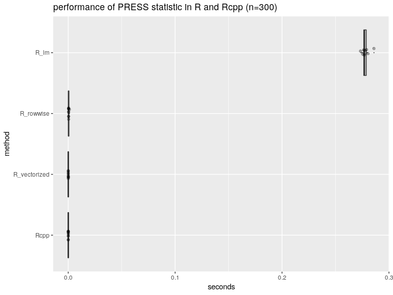
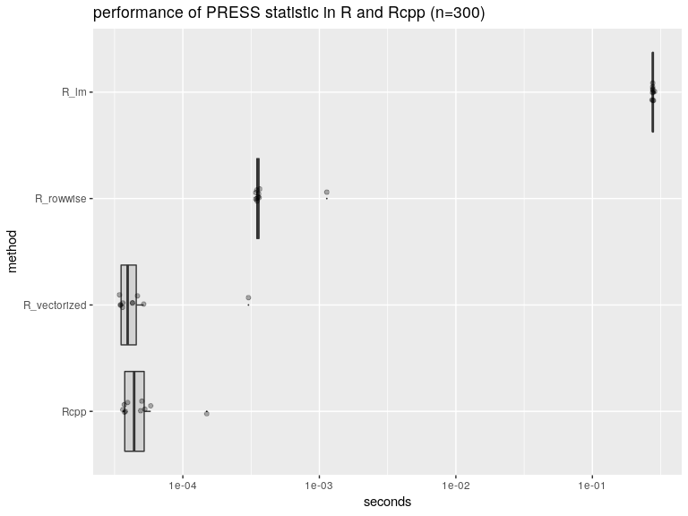
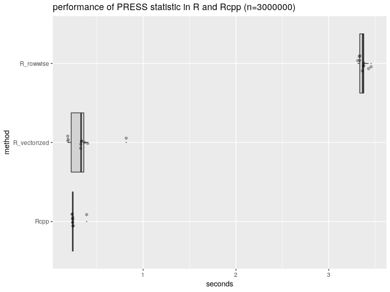
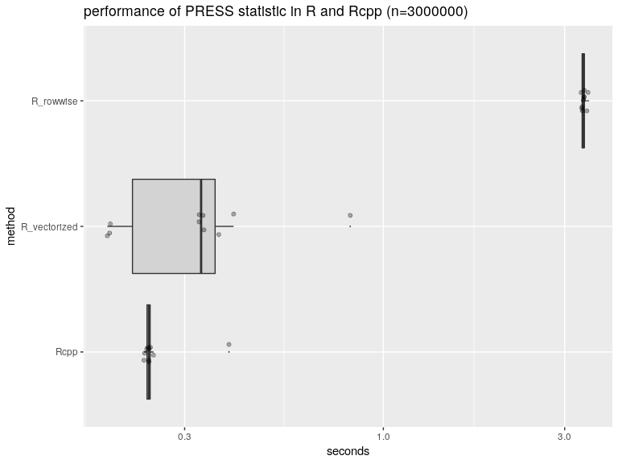

Time xlin\_fits
================

``` r
library("RcppDynProg")
library("WVPlots")
library("ggplot2")
library("microbenchmark")
library("rqdatatable")
```

    ## Loading required package: rquery

``` r
set.seed(2018)

# data
mk_data <- function(g) {
  d <- data.frame(
    x = 0.05*(1:(3*g))) # ordered in x
  n <- nrow(d)
  d$y_ideal <- sin((0.3*d$x)^2)
  d$y_observed <- d$y_ideal + 0.25*rnorm(n)
  d
}

d <- mk_data(100)
n <- nrow(d)
w <- 1 + numeric(n)


timings <- microbenchmark(
  Rcpp = xlin_fits(d$x, d$y_observed, w, 0, n-1),
  R_lm = xlin_fits_lm(d$x, d$y_observed, w),
  R_rowwise = xlin_fits_R(d$x, d$y_observed, w),
  R_vectorized = xlin_fits_V(d$x, d$y_observed, w),
  times = 10L)

print(timings)
```

    ## Unit: microseconds
    ##          expr        min         lq        mean      median         uq
    ##          Rcpp     59.709     63.591    110.3783     69.3920     73.459
    ##          R_lm 331566.619 340713.200 351473.9111 346495.5295 358578.623
    ##     R_rowwise    391.080    393.250    500.8561    402.8685    408.271
    ##  R_vectorized     41.028     43.009     79.1043     45.6120     59.125
    ##         max neval cld
    ##     325.039    10  a 
    ##  389920.675    10   b
    ##    1342.294    10  a 
    ##     359.110    10  a

``` r
p <- data.frame(timings)
p$seconds <- p$time/1e+9
p$method <- as.factor(p$expr)
p$method <- reorder(p$method, p$seconds)

summary <- p %.>%
  project(., 
          mean_seconds = mean(seconds),
          groupby = "method")
print(summary)
```

    ##          method mean_seconds
    ## 1:    R_rowwise 0.0005008561
    ## 2:         R_lm 0.3514739111
    ## 3:         Rcpp 0.0001103783
    ## 4: R_vectorized 0.0000791043

``` r
WVPlots::ScatterBoxPlotH(
  p, 
  "seconds", "method", 
  paste0("performance of PRESS statistic in R and Rcpp (n=", n, ")"))
```



``` r
WVPlots::ScatterBoxPlotH(
  p, 
  "seconds", "method", 
  paste0("performance of PRESS statistic in R and Rcpp (n=", n, ")")) + 
  scale_y_log10()
```



``` r
d <- mk_data(1000000)
n <- nrow(d)
w <- 1 + numeric(n)

timings <- microbenchmark(
  Rcpp = xlin_fits(d$x, d$y_observed, w, 0, n-1),
  R_rowwise = xlin_fits_R(d$x, d$y_observed, w),
  R_vectorized = xlin_fits_V(d$x, d$y_observed, w),
  times = 10L)

print(timings)
```

    ## Unit: milliseconds
    ##          expr       min        lq      mean    median        uq       max
    ##          Rcpp  441.7553  443.8545  463.8962  450.4036  451.1419  590.4729
    ##     R_rowwise 3831.1205 3842.7493 3926.0157 3865.8497 4033.8294 4063.7025
    ##  R_vectorized  524.5465  536.1251  616.2010  549.7321  583.7072 1113.4778
    ##  neval cld
    ##     10 a  
    ##     10   c
    ##     10  b

``` r
p <- data.frame(timings)
p$seconds <- p$time/1e+9
p$method <- as.factor(p$expr)
p$method <- reorder(p$method, p$seconds)

summary <- p %.>%
  project(., 
          mean_seconds = mean(seconds),
          groupby = "method")
print(summary)
```

    ##          method mean_seconds
    ## 1:    R_rowwise    3.9260157
    ## 2:         Rcpp    0.4638962
    ## 3: R_vectorized    0.6162010

``` r
WVPlots::ScatterBoxPlotH(
  p, 
  "seconds", "method", 
  paste0("performance of PRESS statistic in R and Rcpp (n=", n, ")"))
```



``` r
WVPlots::ScatterBoxPlotH(
  p, 
  "seconds", "method", 
  paste0("performance of PRESS statistic in R and Rcpp (n=", n, ")")) + 
  scale_y_log10()
```


