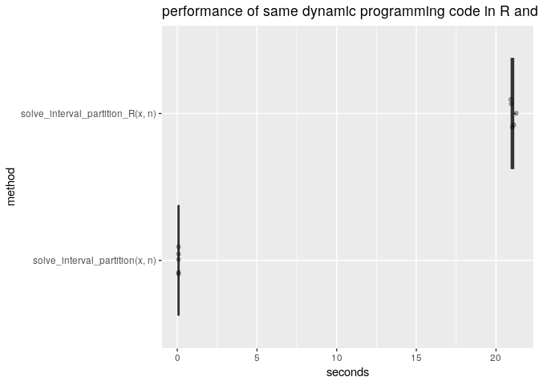

Timings
================

``` r
knitr::opts_chunk$set(fig.width=12, fig.height=8) 
library("RcppDynProg")
library("WVPlots")
library("microbenchmark")
library("rqdatatable")
```

    ## Loading required package: rquery

``` r
set.seed(2018)
n <- 500
x <- matrix(runif(n*n), nrow=n, ncol=n)

solve_interval_partition(x, n)
```

    ## [1]   1 109 230 267 501

``` r
solve_interval_partition_R(x, n)
```

    ## [1]   1 109 230 267 501

``` r
timings <- microbenchmark(
  solve_interval_partition(x, n),
  solve_interval_partition_R(x, n),
  times = 5L)

print(timings)
```

    ## Unit: milliseconds
    ##                              expr         min          lq        mean
    ##    solve_interval_partition(x, n)    77.06462    77.27451    77.97917
    ##  solve_interval_partition_R(x, n) 20921.34167 20952.31931 21056.13098
    ##       median          uq         max neval
    ##     78.20095    78.31472    79.04104     5
    ##  21029.92573 21107.88462 21269.18358     5

``` r
p <- data.frame(timings)
p$seconds <- p$time/1e+9
p$method <- as.factor(p$expr)
p$method <- reorder(p$method, p$seconds)

summary <- p %.>%
  project(., 
          mean_seconds = mean(seconds),
          groupby = "method")
print(summary)
```

    ##                              method mean_seconds
    ## 1: solve_interval_partition_R(x, n)  21.05613098
    ## 2:   solve_interval_partition(x, n)   0.07797917

``` r
ratio <- max(summary$mean_seconds)/min(summary$mean_seconds)
print(ratio)
```

    ## [1] 270.0225

``` r
WVPlots::ScatterBoxPlotH(p, 
                         "seconds", "method", 
                         "performance of same dynamic programming code in R and Rcpp (C++)")
```



------------------------------------------------------------------------

Timings on a 2018 Dell XPS-13 laptop, 16 Gib RAM, LPDDR3, 2133 MT/s, Intel(R) Core(TM) i5-8250U CPU @ 1.60GHz (8 cores reported), idle, charged, and plugged into power supply. Ubuntu 18.04.1 LTS.

``` r
R.version.string
```

    ## [1] "R version 3.5.1 (2018-07-02)"

``` r
R.version
```

    ##                _                           
    ## platform       x86_64-pc-linux-gnu         
    ## arch           x86_64                      
    ## os             linux-gnu                   
    ## system         x86_64, linux-gnu           
    ## status                                     
    ## major          3                           
    ## minor          5.1                         
    ## year           2018                        
    ## month          07                          
    ## day            02                          
    ## svn rev        74947                       
    ## language       R                           
    ## version.string R version 3.5.1 (2018-07-02)
    ## nickname       Feather Spray

``` r
sessionInfo()
```

    ## R version 3.5.1 (2018-07-02)
    ## Platform: x86_64-pc-linux-gnu (64-bit)
    ## Running under: Ubuntu 18.04.1 LTS
    ## 
    ## Matrix products: default
    ## BLAS: /usr/lib/x86_64-linux-gnu/blas/libblas.so.3.7.1
    ## LAPACK: /usr/lib/x86_64-linux-gnu/lapack/liblapack.so.3.7.1
    ## 
    ## locale:
    ##  [1] LC_CTYPE=en_US.UTF-8       LC_NUMERIC=C              
    ##  [3] LC_TIME=en_US.UTF-8        LC_COLLATE=en_US.UTF-8    
    ##  [5] LC_MONETARY=en_US.UTF-8    LC_MESSAGES=en_US.UTF-8   
    ##  [7] LC_PAPER=en_US.UTF-8       LC_NAME=C                 
    ##  [9] LC_ADDRESS=C               LC_TELEPHONE=C            
    ## [11] LC_MEASUREMENT=en_US.UTF-8 LC_IDENTIFICATION=C       
    ## 
    ## attached base packages:
    ## [1] stats     graphics  grDevices utils     datasets  methods   base     
    ## 
    ## other attached packages:
    ## [1] rqdatatable_1.1.2    rquery_1.2.1         microbenchmark_1.4-6
    ## [4] WVPlots_1.0.7        RcppDynProg_0.1.0   
    ## 
    ## loaded via a namespace (and not attached):
    ##  [1] Rcpp_1.0.0        sigr_1.0.3        pillar_1.3.0     
    ##  [4] compiler_3.5.1    plyr_1.8.4        bindr_0.1.1      
    ##  [7] tools_3.5.1       digest_0.6.18     lattice_0.20-38  
    ## [10] evaluate_0.12     tibble_1.4.2      gtable_0.2.0     
    ## [13] nlme_3.1-137      mgcv_1.8-26       pkgconfig_2.0.2  
    ## [16] rlang_0.3.0.1     Matrix_1.2-15     parallel_3.5.1   
    ## [19] yaml_2.2.0        xfun_0.4          bindrcpp_0.2.2   
    ## [22] gridExtra_2.3     withr_2.1.2       stringr_1.3.1    
    ## [25] dplyr_0.7.8       knitr_1.21        grid_3.5.1       
    ## [28] tidyselect_0.2.5  data.table_1.11.8 glue_1.3.0       
    ## [31] R6_2.3.0          rmarkdown_1.11    wrapr_1.8.2      
    ## [34] ggplot2_3.1.0     purrr_0.2.5       magrittr_1.5     
    ## [37] scales_1.0.0      htmltools_0.3.6   assertthat_0.2.0 
    ## [40] colorspace_1.3-2  labeling_0.3      stringi_1.2.4    
    ## [43] lazyeval_0.2.1    munsell_0.5.0     crayon_1.3.4
