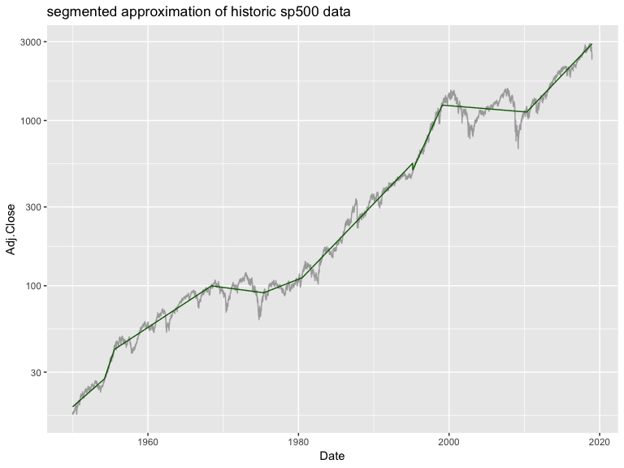

segmented Example
================

``` r
library("segmented")
library("ggplot2")

# Data from: 
# https://finance.yahoo.com/quote/%5EGSPC/history?period1=-630950400&period2=1546416000&interval=1d&filter=history&frequency=1d
sp500 <- read.csv("^GSPC.csv")
sp500$Date <- as.Date(sp500$Date)
sp500$x <- as.numeric(sp500$Date)
sp500$log_price <- log(sp500$Adj.Close)

m1 <- lm(log_price ~ x, data = sp500)
# settings from help(segmented)
o <- segmented.lm(m1,seg.Z=~x,psi=list(x=NA), 
    control=seg.control(stop.if.error=FALSE,n.boot=0, it.max=20))
sp500$spred <- exp(predict(o, newdata = sp500))

ggplot(data = sp500, aes(x = Date)) +
  geom_line(aes(y=Adj.Close), color = "darkgray") +
  geom_line(aes(y=spred), color = "darkgreen") +
  ggtitle("segmented approximation of historic sp500 data") +
  theme(legend.position = "none") +
  scale_color_brewer(palette = "Dark2") +
  scale_y_log10()
```


