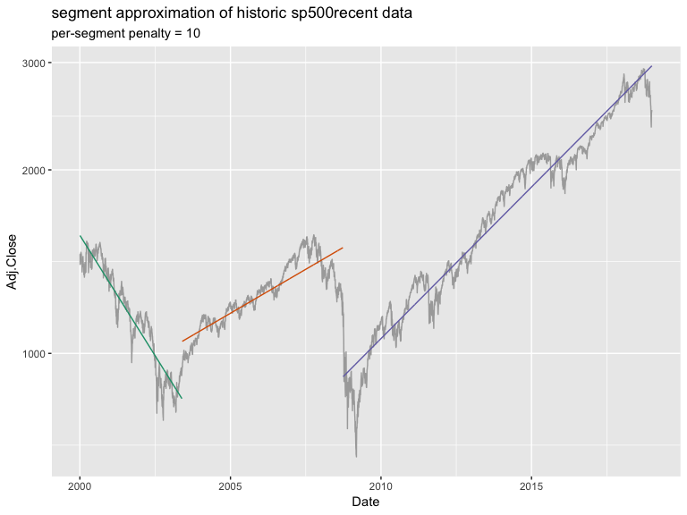
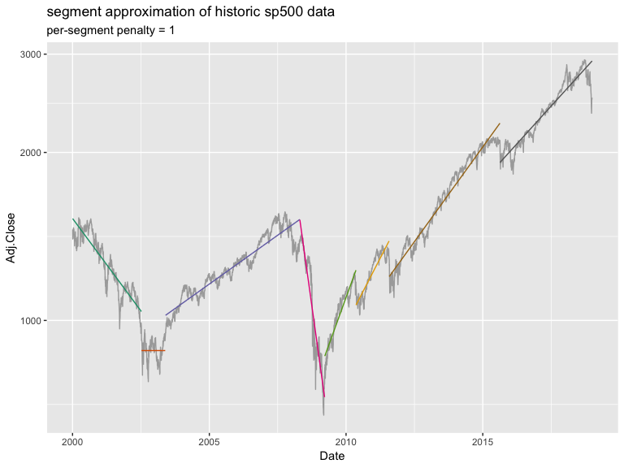
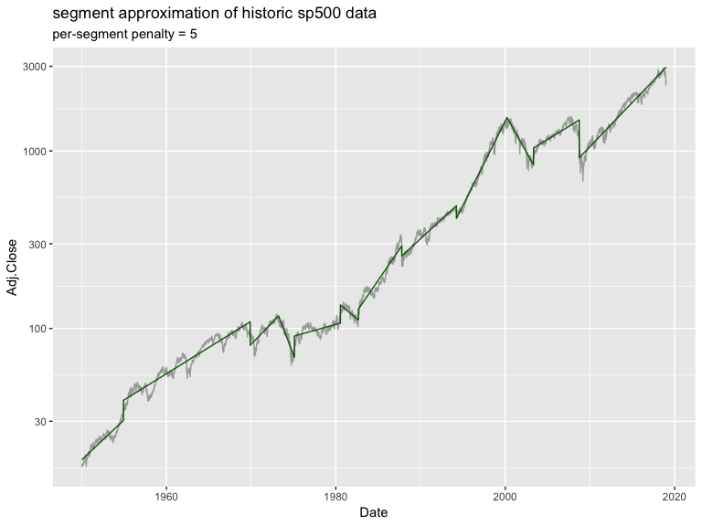
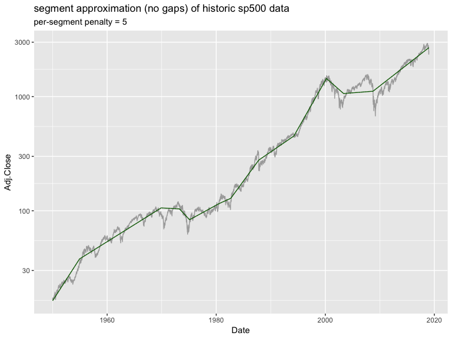

sp500 long
================

``` r
library("RcppDynProg")
library("ggplot2")

# Data from: 
# https://finance.yahoo.com/quote/%5EGSPC/history?period1=-630950400&period2=1546416000&interval=1d&filter=history&frequency=1d
sp500 <- read.csv("^GSPC.csv")
sp500$Date <- as.Date(sp500$Date)
sp500$x <- as.numeric(sp500$Date)
sp500$log_price <- log(sp500$Adj.Close)


sp500recent <- sp500[sp500$Date >= as.Date('2000-01-01'), ]


# find penalty
sp500recent$permuted <- sp500recent$log_price[sample.int(nrow(sp500recent), 
                                                         nrow(sp500recent), 
                                                         replace = FALSE)]
# look for a penalty that prefers 1 segment on permuted data
lb <- 0
ub <- 100
while(TRUE) {
  soln <- solve_for_partition(sp500recent$x, sp500recent$permuted, penalty = ub, max_k = 3)
  if(nrow(soln)==2) {
    break
  }
  lb <- ub
  ub <- 10*ub
}
while(TRUE) {
  penalty <- ceiling((lb+ub)/2)
  if(penalty>=ub) {
    break
  }
  soln <- solve_for_partition(sp500recent$x, sp500recent$permuted, penalty = penalty, max_k = 3)
  if(nrow(soln)==2) {
    ub <- penalty
  } else {
    lb <- penalty
  }
}
print(penalty)
```

    ## [1] 10

``` r
soln <- solve_for_partition(sp500recent$x, sp500recent$log_price, penalty = penalty)
sp500recent$estimate <- exp(approx(soln$x, soln$pred, 
                             xout = sp500recent$x, 
                             method = "linear", rule = 2)$y)
sp500recent$group <- as.character(
  findInterval(sp500recent$x, soln[soln$what=="left", "x"]))

ggplot(data = sp500recent, aes(x = Date)) +
  geom_line(aes(y=Adj.Close), color = "darkgray") +
  geom_line(aes(y=estimate, color = group)) +
  ggtitle("segment approximation of historic sp500recent data",
          subtitle = paste("per-segment penalty =", penalty)) +
  theme(legend.position = "none") +
  scale_color_brewer(palette = "Dark2") +
  scale_y_log10()
```



``` r
penalty <- 1

soln <- solve_for_partition(sp500recent$x, sp500recent$log_price, penalty = penalty)
sp500recent$estimate <- exp(approx(soln$x, soln$pred, 
                             xout = sp500recent$x, 
                             method = "linear", rule = 2)$y)
sp500recent$group <- as.character(
  findInterval(sp500recent$x, soln[soln$what=="left", "x"]))

ggplot(data = sp500recent, aes(x = Date)) +
  geom_line(aes(y=Adj.Close), color = "darkgray") +
  geom_line(aes(y=estimate, color = group)) +
  ggtitle("segment approximation of historic sp500 data",
          subtitle = paste("per-segment penalty =", penalty)) +
  theme(legend.position = "none") +
  scale_color_brewer(palette = "Dark2") +
  scale_y_log10()
```



``` r
penalty <- 5

soln <- solve_for_partition(sp500$x, sp500$log_price, penalty = penalty)
sp500$estimate <- exp(approx(soln$x, soln$pred, 
                             xout = sp500$x, 
                             method = "linear", rule = 2)$y)

sp500$group <- as.character(
  findInterval(sp500$x, soln[soln$what=="left", "x"]))

ggplot(data = sp500, aes(x = Date)) +
  geom_line(aes(y=Adj.Close), color = "darkgray") +
  geom_line(aes(y=estimate, group = group), color = "darkgreen") +
  ggtitle("segment approximation of historic sp500 data",
          subtitle = paste("per-segment penalty =", penalty)) +
  theme(legend.position = "none") +
  scale_color_manual(values = colors) +
  scale_y_log10()
```



Naive gaps (TODO: need to find breakpoints that are good for the no-gap solution).

``` r
sl <- soln[soln$what=='left', ]
fit <- vtreat:::encode_x_as_lambdas(
  sp500$x, min(sp500$x), max(sp500$x),
  sl$x)
vars <- setdiff(colnames(fit), "intercept")
fit$y <- sp500$log_price
fmla <- wrapr::mk_formula("y", vars)
model <- lm(fmla, data = fit)
sp500$pred <- exp(predict(model, newdata = fit))

ggplot(data = sp500, aes(x = Date)) +
  geom_line(aes(y=Adj.Close), color = "darkgray") +
  geom_line(aes(y=pred), color = "darkgreen") +
  ggtitle("segment approximation (no gaps) of historic sp500 data",
          subtitle = paste("per-segment penalty =", penalty)) +
  theme(legend.position = "none") +
  scale_color_brewer(palette = "Dark2") +
  scale_y_log10()
```



Fit piecewise constant on delta series.

``` r
penalty <- 0.01

sp500$delta_log_price <- c(0, sp500$log_price[-1] - sp500$log_price[-nrow(sp500)])
  
soln <- solve_for_partitionc(sp500$x, sp500$delta_log_price, penalty = penalty)
sl <- soln[soln$what=='left', ]
fit <- vtreat:::encode_x_as_lambdas(
  sp500$x, min(sp500$x), max(sp500$x),
  sl$x)
vars <- setdiff(colnames(fit), "intercept")
fit$y <- sp500$log_price
fmla <- wrapr::mk_formula("y", vars)
model <- lm(fmla, data = fit)
sp500$pred <- exp(predict(model, newdata = fit))

ggplot(data = sp500, aes(x = Date)) +
  geom_line(aes(y=Adj.Close), color = "darkgray") +
  geom_line(aes(y=pred), color = "darkgreen") +
  ggtitle("segment approximation (slope ests, no gaps) of historic sp500 data",
          subtitle = paste("per-segment penalty =", penalty)) +
  theme(legend.position = "none") +
  scale_color_brewer(palette = "Dark2") +
  scale_y_log10()
```


